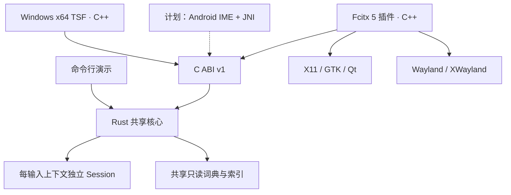

# 架构与当前实现

图中的 Linux 出口是架构接入方向；实际桌面状态见 COMPATIBILITY，不意味着全部验证。

## 核心和状态

`chengyin-core` 禁用 unsafe，没有 I/O、线程或系统依赖。不可变词库通过 Arc 共享，每个输入上下文单独 Session。初始化一次预留工作区，真实词库下输入、整句解码、翻页、局部编辑、选段撤回、提交和 reset 的计数回归为零次堆分配。

Session 分开保存原始 ASCII 拼音、光标、已选中文与输入边界；显示预编辑由已选中文和未译拼音组成。前缀候选带 consumed 字节数，选择后保留尾部；在已选边界退格可撤回。左右/Home/End/Delete 编辑剩余拼音。新输入、撤回如果超过输入/文本/歧义预算，保留原状态。Enter 提交显示原文，Esc 清除整个组合，标点强制提交候选及剩余原文后透传。

commit 属于刚处理的事件，getter 不清空。适配器每次 process 后读取一次，包含 handled=false，再决定透传；下一 process/reset 清空。选择前缀时 commit 为空，预编辑持续存在。候选、page 和 selected 都相对于当前 9 条核心页；预编辑光标使用 UTF-8 字节位置，Windows 在 TSF 范围内转换为 UTF-16。

## 词库、游标和整句图

184,173 条字词固定来源 Rime pinyin-simp/Apache-2.0、jieba/MIT、THUOCL/MIT 与 phrase-pinyin-data/MIT，原始文件、完整许可和哈希在 data/sources/；词库许可独立于代码（代码为 GPL-3.0-or-later，见 docs/LICENSING.md）。离线 Python 转换产生 daily.tsv，CLI 编译为 daily.mswydict；回归比较已提交二进制与重建结果，阻止源码/负载不同步。示例词典继续用于历史回归。

字词按频率降序、文字/拼音字典序排列，ID 同时表示词典排名。字符串存于一个 UTF-8 池，节点和边为连续数组，terminal 保留全部同音词。节点仅缓存最佳后代 ID。游标先遍历完整匹配，再用优先堆按最优后代展开前缀候选；去重和分页在 Session 中进行，没有每键全词库扫描，也不再将全体候选裁成 top-9。

规范拼音以撇号分音节；查询字母可直接沿边或省略词典中的分隔符，显式撇号必须匹配。解码从每个输入位置生成字词边，保留拼写切分歧义。向后 Viterbi 每个位置保留 16 条路径，每个 terminal 使用前 16 个词。词代价为 `ln(总词频) - ln(词频) + 1`，加载时预计算；最后不足 6 字节的未完音节可以预测词尾，增加 2 的代价。输出多词整句和可供分段选择的前缀词；未登录尾部可原文回退。

该模型加入自写常用搭配的前后词奖励；每会话 32 槽缓存复用词对评分。它是离线基线，beam、缩写惩罚和搭配覆盖会影响质量，需要独立语料评测。

预算：63 字节原始拼音、256 字节显示/提交、256 活跃 trie 状态、1024 堆项、4096 已生成候选，单页 9 条。计数或 heap 预算耗尽明确报告 LIMITED/预算 getter；游标报错后应重置，不继续将不完整的遍历当作完整排名。新输入的查词歧义超限回滚；某个后缀解码超限只限制整句建议，不丢已输入文字。会话工作区与预留堆合计约 65,031 字节。

二进制为版本化小端数组与字符串池，CRC32 覆盖负载。加载验证总长/字段边界、UTF-8、条目排名、节点/边顺序和唯一父节点、terminal ID、子树最优排名、拼音与叶节点的一致性。解析后生成独立只读词库，不依赖调用方缓冲区。64 MiB、25 万词是输入上限，不能当作加载峰值保证。CRC 提供损坏检测，不是发布签名或沙箱。

## 首拼、混输与联想

词典加载时为合法音节生成首字母及 zh/ch/sh 跳转。缩写结束的状态只能继续
到下一个音节，不能回到已跳过的音节内部；独立穷举别名回归覆盖这个边界。
有完整全拼解析时先生成它，缩写整词/整句后续按需展开；没有全拼路径时直接
走混输词图。普通与额外句子各保留最多 16 条，旧候选文本不会被后续解码覆盖。

候选保留生成类别：完整词、缩写整词、句子、前缀段、词尾预测。当前上下文
和最近 32 个选词 ID 调整首个 64 条中的同类排名，评分用固定栈数组只计算一次。
上下文排序不把预测尾部移到完整解析之前。可解释搭配奖励与词频组成句子基线。

上屏后从静态搭配和只读文字索引查后续词，最多 128 条；每个前缀扫描最多
4096 条，预算显式报告。联想的预编辑为空、consumed=0，Tab/明确选择才上屏；
空格/数字/常规编辑键关闭联想并透传。上下文/偏好/cache 只在各自 Session 内。
Windows 使用上次提交后折叠的 range 作候选锚点，不创建空 composition；
选择写锁内校验光标、敏感属性和 generation，只在当前位置插入后续文字。
失焦、外部编辑、reset、词库切换清除状态，未读取应用周边文本；持久选词偏好由下述独立 Profile 保存。

共享 Rust 导入器处理 SCEL、Unicode 文本及 v1/v2 二进制，Windows 单独处理
GBK 编码和文件 I/O。设置进程合并/编译，再互斥、刷盘和原子替换快照。
新增 C ABI 为 additive v1 接口，详见头文件；导入/导出会分配，不属于按键路径。

## C ABI

`chengyin-ffi` 输出静态库和动态库，公开接口见 `include/chengyin_ime.h`。固定宽度整数表示键、字段和结果；不跨 ABI 传递 Rust String/Vec/enum。所有文本用调用方缓冲区复制，先查询含 NUL 的所需容量；容量不足完全不写，避免截断 UTF-8。

词典句柄拥有 Arc；创建 Session 后原词典句柄可以释放。释放函数必须与构造函数配对；空指针有定义行为，但任意无效指针/重用已释放句柄不在保护范围内。单 Session 不能并发使用；读写的序列化由适配器负责。所有可能 panic 的 ABI 路径捕获 unwind；OOM、无效外部指针和进程级故障仍可能终止宿主。不要在 release 配置中启用 panic=abort 后继续声称 panic 被隔离。

ABI v1 增加了 `chengyin_dictionary_new_demo` 和 `chengyin_session_set_dictionary`，保留原函数签名和 commit/所有权契约。新增键、二进制构造、共享句柄复制、光标/翻页/跨度 getter 及候选高亮 setter 均为 ABI v1 的追加接口。切换仅允许预编辑为空，否则返回 BUSY 且不修改状态；成功时复用缓冲区，并保留上一事件 commit。使用这些新增函数的适配器需要配套新版库，当前 Fcitx 模块静态链接同一次构建的核心。

## Fcitx 词典加载与生命周期

配置使用 Fcitx 原生 Configuration/INI 接口，词典路径必须为空（演示词典）或绝对路径。仅词典读取、校验、构建和退役词典析构在独立工作线程中进行；小型配置文件的读写沿用框架主线程接口。每个插件一个工作线程、最多一个待处理请求，用请求序号防止旧加载结果覆盖较新的设置。

worker 用普通文件检查和有界分块读取拒绝 FIFO/设备及过大输入，构建完成后经 EventDispatcher 回到主线程发布。成功才保存配置工具提交的设置；失败保留现有词典，恢复界面中的原路径。手工编辑的磁盘配置不被自动覆盖。保存失败单独报告，不能把“当前已启用”当成“重启后仍生效”。

配置持久化使用框架的路径解析、临时文件和 INI 序列化，但显式检查文件 fsync、close、rename 与目录 fsync。Fcitx 5.1.12 的 `safeSaveAsIni` 返回值未覆盖最终重命名失败；回归测试用目标路径被目录占用的情况验证该缺口。失败时保留可用的内存词典，并提示配置可能未持久化。

每个 State 持有词典快照及 Rust Session；活跃组合不换词典，空闲会话切到最新快照。旧快照先交给后台回收队列，再允许主线程释放 Session 的旧 Arc；State 的成员声明顺序也保证 Session 先析构。后台仅在队列非空时每 250 ms 检查引用计数，使最后一次大词典析构避开正常按键线程。插件关闭时 join worker、detach dispatcher，再销毁会话和句柄；关闭期间的清理不属于热路径保证。

取消检查发生于分块读取和构建完成后，Rust TSV 构建过程暂不可中断。O_NONBLOCK 可防止 FIFO 打开阻塞，不承诺普通磁盘、网络文件系统或内核故障能立即中断。生产词典的内存峰值和可取消二进制加载仍属后续优化。

## 平台边界

- Fcitx 5：每个 InputContextProperty 拥有独立 Session；框架负责显示协议、光标矩形、候选窗口和输入法切换。候选点击带有版本号，旧候选列表无法提交新状态。当前原型每次刷新候选 UI 会分配对象，核心零分配不涵盖 UI。
- Windows：TSF 适配负责 COM 生命周期、ITfTextInputProcessorEx、编辑会话锁、composition range、候选 UI 与宿主线程重入，绝不在全局键盘钩子内做解码。处理 UTF-16 范围和 UTF-8 核心之间的索引转换。
- Android：InputMethodService 负责 InputConnection、setComposingText/commitText、EditorInfo、软键盘布局和进程生命周期。JNI 只传有界事件和输出，系统主线程不做词典加载或磁盘持久化。

密码/敏感输入由平台标志决定；Fcitx 原型绕过组合并清空临时状态。Windows 原型同样检查密码/私密/PIN 作用域、禁用和只读上下文；Android 需实现对应能力。Windows 与 Fcitx 5 各自有独立 Profile 与后台持久化层（Fcitx 侧见 platforms/fcitx5/profile_store.cpp，单进程写入、无跨进程锁）；Android 尚未接入持久学习。
Profile 使用最多 4,096 项的有序记录，key 保留实际拼写和手工分隔，text 仅纯中文；
计数与序列决定优先级。MSWYUSR1 二进制校验长度、UTF-8、顺序、语法和 CRC，
最多 2 MiB。Arc<str> 共享不可变拼写/文本，选择确认只复制记录表而非全部字符串。
Session.process 和 display_preedit 不分配；host SetText 成功后显式 learn_commit
更新快照，这一步允许分配，不在零分配承诺内。128 项有界后台队列复制栈缓冲，
工作线程在跨进程互斥下重载/合并/刷盘/原子替换。共享 epoch 使清除/导入前
的排队事件失效；退役服务 join/drain 后才允许 DLL 卸载。设置/配置激活时读取，
不把磁盘/注册表 I/O 放入解码或候选 paint。

## Windows 预览的编辑与生命周期

TSF 服务实现 TextInputProcessorEx、按键/线程管理/文本编辑/组合结束通知接口。COM apartment 内串行调用核心；每个绑定的输入上下文拥有独立 Rust Session，切换时释放旧会话。IUnknown 身份统一，工厂拒绝聚合；对象、编辑会话、候选窗释放完毕后才允许 DLL 卸载。

OnTestKeyDown 只判断按键，不创建/修改组合。OnKeyDown 申请同步 READWRITE 编辑锁，获锁后才调用核心并更新 composition range；拒锁时透传按键，不排队延迟提交。ASCII 标点与候选一起写入同一范围，消费本次按键，避免先透传标点后异步插入汉字。宿主 SetText 失败时结束组合并透传；文字成功写入后，即使 SetSelection 失败仍消费本次键，防止重复文字。

范围与宿主文本为 UTF-16，核心为 UTF-8；用有界栈缓冲转换，测试包含非 BMP 字符。支持组合中间编辑，核心字节光标映射为 UTF-16 插入点；外部编辑、鼠标移动或失焦保留宿主已有文本并结束组合，绝不修改新输入框的位置。焦点清理可申请延后 EndComposition，但没有延后文本插入；已退役组合的结束回调不能清空新组合。

候选窗为被动 GDI popup，支持键盘、鼠标和宿主候选接口；不改变宿主的 DPI awareness。按有效 GetTextExt 定位、限制在工作区，排版暂不可用时保留同一上下文有效锚点，尝试 Win32 光标/视图回退；明确裁剪时隐藏；排版完成后的布局通知申请只读编辑会话刷新，每个上下文最多一个待处理更新，generation 阻止退役回调覆盖新候选。定位只折叠克隆的 range，不改变组合本身；字体按 DPI/设置缓存；保留 popup 和离屏 DC/bitmap，每次更新一次 BitBlt，抑制背景擦除。拥有者窗口销毁时 popup 自动销毁，适配器清空窗口句柄并允许之后重建。核心零分配不涵盖 COM 编辑对象和候选 UI。

注册使用机器级 COM 类与简体中文 TSF profile/category；离线 EXE 安装向导负责提升权限和注册，正常输入无需管理员。安装器先做文件校验和 COM 探测，管理同版修复、升级与失败回滚。注册入口拒绝已有类，卸载入口验证 DLL 所属路径；失败保留可重试文件。当前为 x64，注册 UI-element/immersive/COM-less/input-mode 类别并实现宿主候选接口；安全模式不激活。实际操作系统接入仍以 COMPATIBILITY 中的实测证据为准。

## 后续可替换部分

保持按键会话/C ABI 稳定，将单纯 trie 查词替换为音节图与词图解码。新增候选分页、光标编辑、配置或词典错误详情时，添加有版本的接口；不改变既有函数参数含义。生产词典布局必须在相同词库、相同测试集和相同内存口径下比较后决定。

## Windows 设置与输入接入 / preview5

设置为原生 Win32 五页窗口，有滚动、键盘导航、DPI/主题字体、未保存草稿和
异步词库导入；不嵌入浏览器。候选支持纵向/横向换行、页数/字体/密度、主题
及显示层音节分隔。分隔使用编译期音节偏移表二分查询，无运行时缓存分配。
ShiftSwitch 只消费真实按键事件来追踪单独释放；OnTest 回调保持纯查询，
组合键、孤立重复和禁用右 Shift 不触发切换；TSF compartments 同步中文模式。
真实 OnEndEdit 对比当前组合文字和核心光标，迟到的自身通知不结束组合。
输入测试程序显式激活 ITfThreadMgr，并在对话框 Tab 处理前分派 TSF 按键。
这些机制的模拟测试不替代真实 Win32/Scintilla 应用中的系统 text store 验收。
